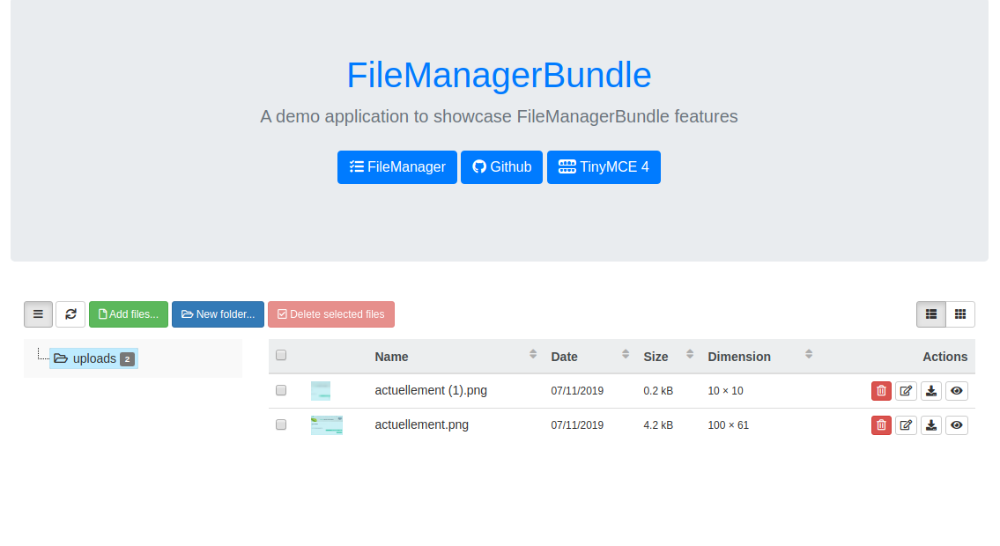
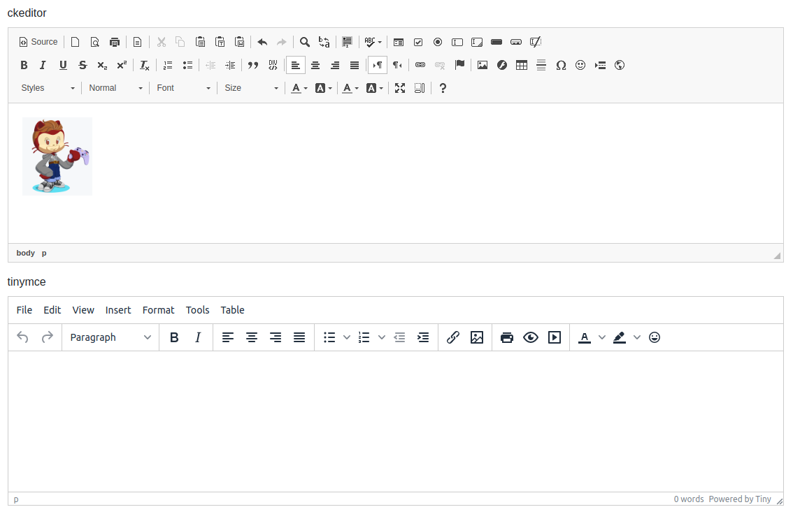

FileManager Demo
================

A demo application to showcase the main features of [FileManager][1]

* [master version](https://github.com/artgris/FileManagerBundleDemo/tree/master): Symfony 4.4 demo
* [symfony-5 version](https://github.com/artgris/FileManagerBundleDemo/tree/symfony-5): Symfony 5.0 demo

How to install this project
---------------------------
     
  1. `git clone git@github.com:artgris/FileManagerBundleDemo.git filemanager-bundle-demo`
  1. `cd filemanager-bundle-demo/`
  1. `composer install`
  1. `php bin/console ckeditor:install`
  1. `php bin/console assets:install --symlink`
    
Screenshot
----------

 
[1]: https://github.com/artgris/FileManagerBundle
